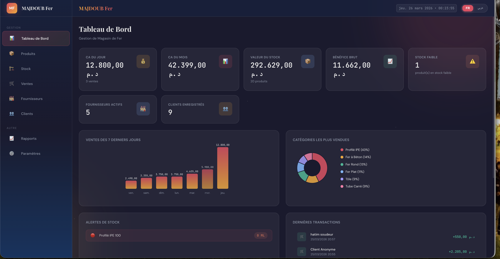

# MAJDOUB Fer — Gestion de Magasin

Application web (SPA) de gestion d’un magasin de ferraille/matériaux métalliques.

## Captures d’écran

## Fonctionnalités

- Tableau de bord (KPI, alertes stock, activité récente)
- Gestion des produits
- Suivi du stock et des entrées
- Point de vente (ventes + panier)
- Gestion des fournisseurs et clients
- Rapports
- Paramètres du magasin
- Génération PDF (factures et bons de réception)
- Interface bilingue : Français / Arabe

## Stack technique

- HTML5
- CSS3
- JavaScript (Vanilla)
- `localStorage` pour la persistance des données
- jsPDF pour l’export PDF

## Lancer le projet

Aucune installation n’est nécessaire.

1. Ouvrir le dossier du projet.
2. Lancer `index.html` dans un navigateur.

> Option recommandée : utiliser une extension de serveur local (ex: Live Server) pour un meilleur confort de développement.

## Structure du projet

- `index.html` — point d’entrée
- `assets/css/` — styles globaux, composants et modules
- `assets/js/` — logique applicative
  - `app.js` — router SPA, UI globale
  - `db.js` — couche de données (CRUD via localStorage)
  - `i18n.js` — traductions FR/AR
  - `pdf.js` — génération des PDF
  - `modules/` — modules métier (dashboard, produits, ventes, etc.)
- `screenshots/` — captures de l’application

## Données

- Les données sont stockées dans le navigateur (localStorage).
- Effacer les données du navigateur supprime les données de l’application.

## Licence

Projet interne / privé (à adapter selon votre usage).
